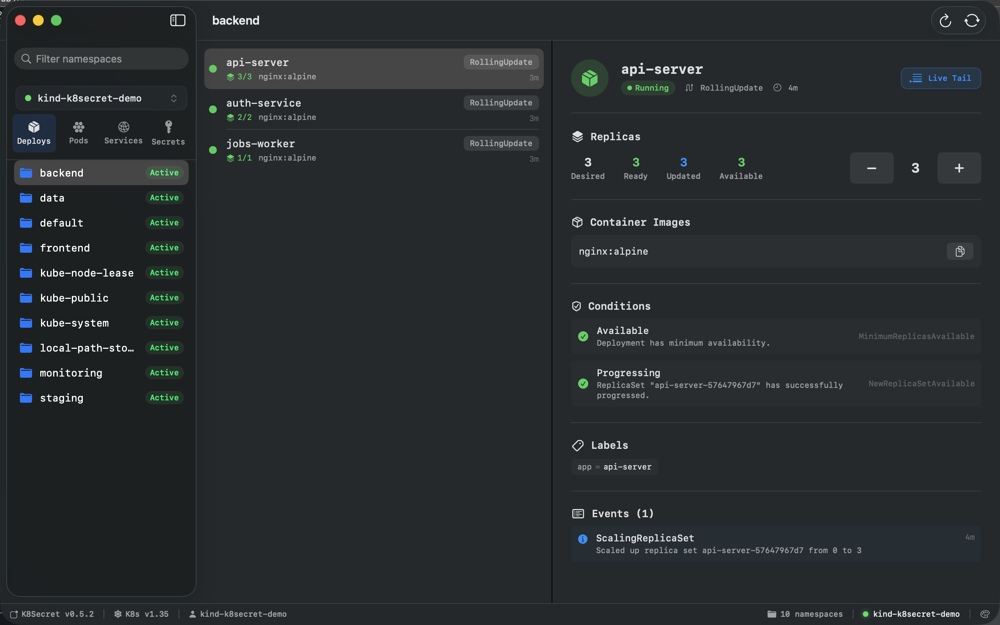
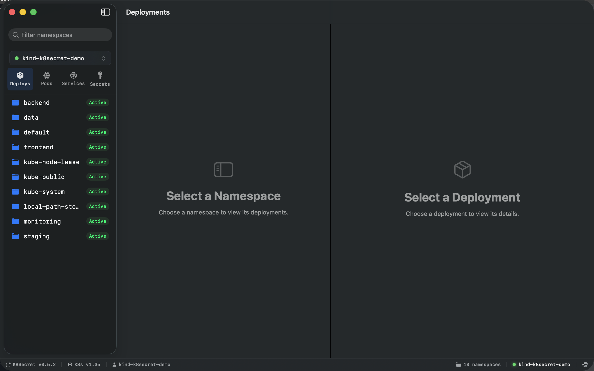
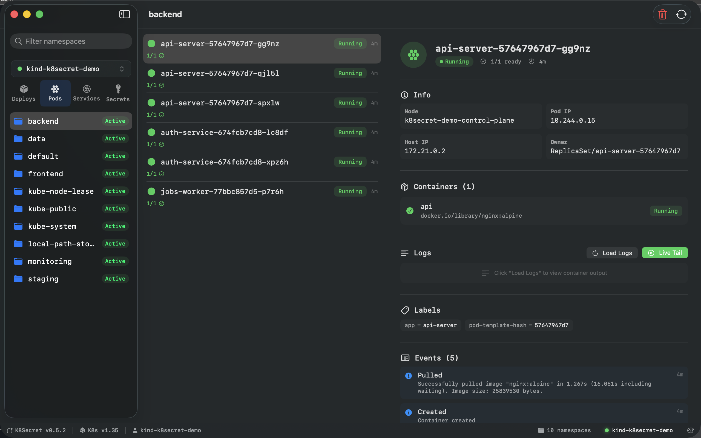
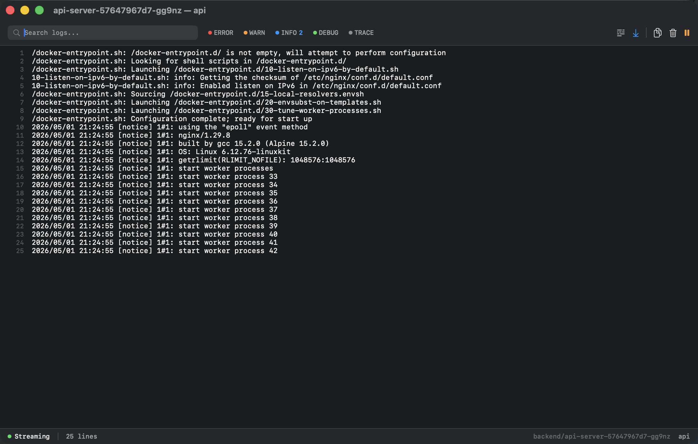
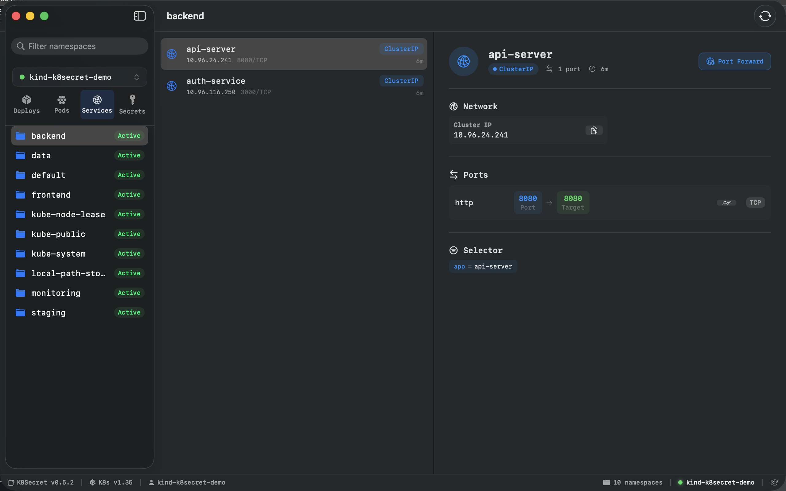
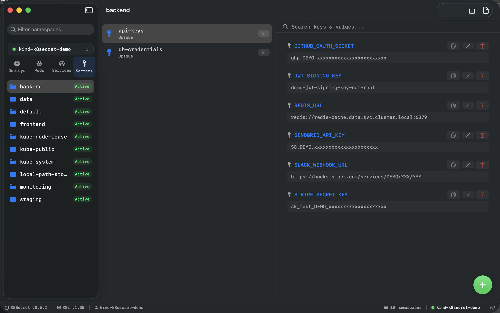
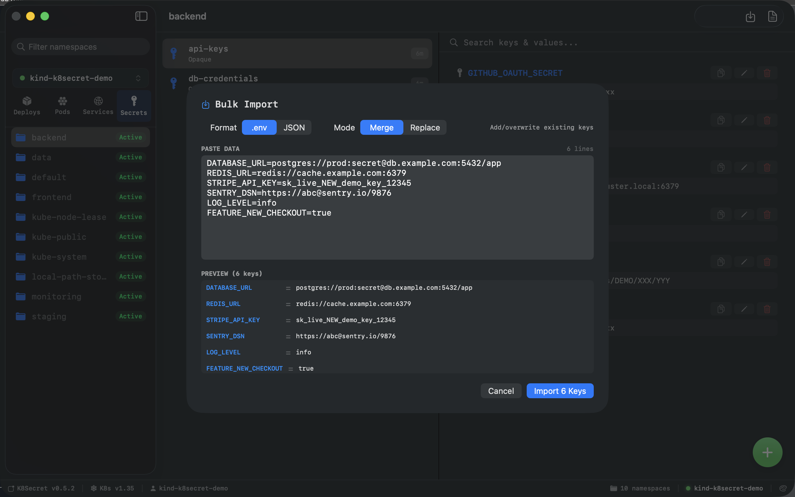
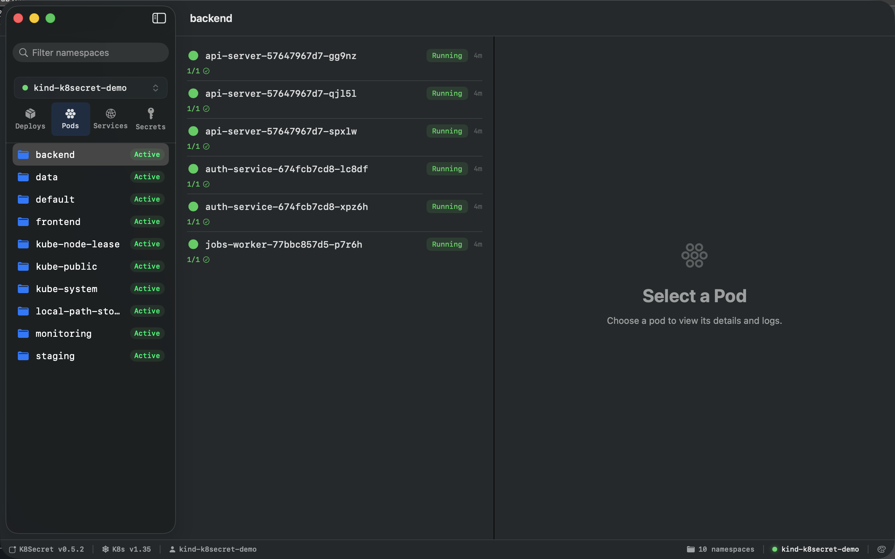
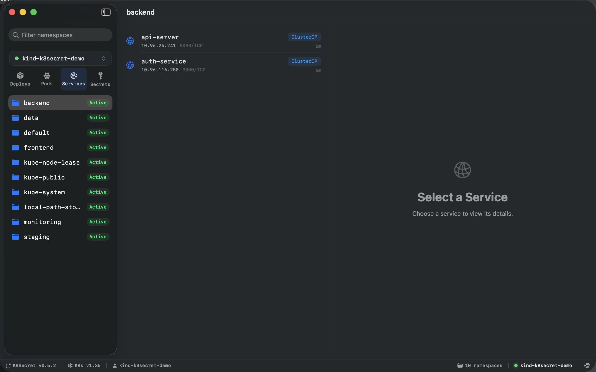
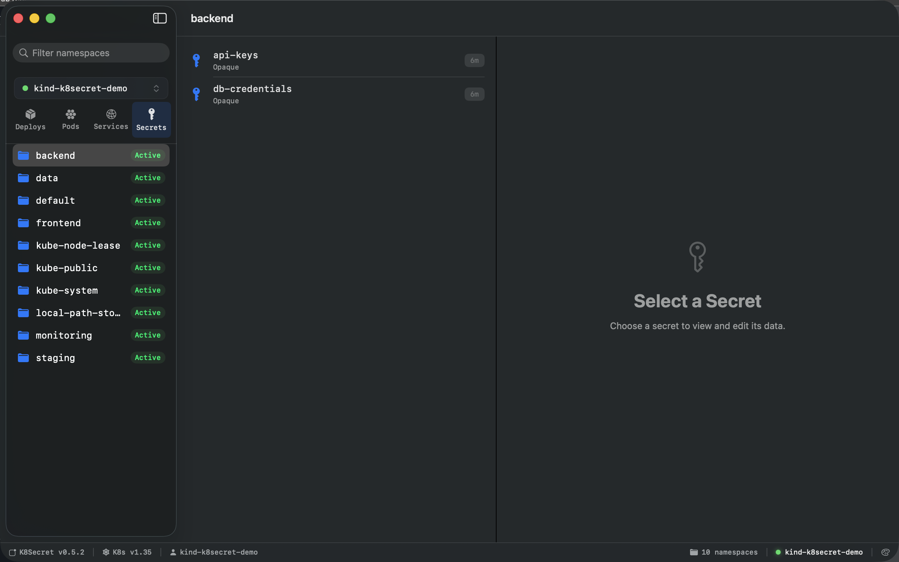

# K8Secret

A native macOS app for managing Kubernetes clusters — secrets, deployments, services, pods, logs, and port-forwarding — in a single keyboard-friendly window.



K8Secret talks directly to the Kubernetes API using your `~/.kube/config` (no kubectl shell-out except for port-forwards), so it's fast, multi-cluster aware, and behaves the way you expect from a real macOS app — multi-window, native menus, keyboard navigation, cmd-tab-able.

---

## Features

### Deployments — view, scale, rollout

See replica counts, container images, conditions, labels, and recent events at a glance. Scale up or down in-place, or watch a rollout progress without leaving the app.



### Pods — metrics, status, and live logs

Per-pod CPU/memory usage (against requests and limits), container info, pod IP, owner, and an Events feed. Logs stream live in a dedicated window with severity filters and search.





### Services — inspect and port-forward

ClusterIP, ports, selectors. Click **Port Forward** and K8Secret picks a free local port, runs `kubectl port-forward` under the hood, opens your browser, and auto-retries with exponential backoff if the connection drops.



### Secrets — view, edit, bulk import/export

The killer feature. Stop copy-pasting `kubectl get secret -o yaml | base64 -d`. K8Secret decodes and displays Opaque secrets as plain key/value pairs, with edit-in-place, search, and reveal-on-click.



Bulk import from `.env` or JSON — merge with existing keys or replace the whole secret. Live preview of what will be imported before you commit.



### Multi-cluster, multi-window

Switch contexts from the sidebar dropdown or open a second cluster in a new window — useful when comparing staging vs. production. Each window remembers its own context and theme color.







---

## Install

One-liner (downloads the latest signed `.dmg`, copies `K8Secret.app` to `/Applications`):

```bash
curl -fsSL https://raw.githubusercontent.com/jai-bhardwaj/k8secret/main/release/install.sh | bash
```

Or grab the `.dmg` manually from the [latest GitHub release](https://github.com/jai-bhardwaj/k8secret/releases/latest), or look up the version + URL via the [release manifest](https://raw.githubusercontent.com/jai-bhardwaj/k8secret/main/release/latest.json).

K8Secret ships **ad-hoc signed**, not notarized — the installer strips the quarantine bit so it launches without a Gatekeeper prompt. If you build from source, you'll need to do the same (see [Building](#building-from-source)).

---

## Requirements

- macOS **14 (Sonoma) or later** — uses SwiftUI's `@Observable` and `NavigationSplitView`
- A working `~/.kube/config` with at least one context
- `kubectl` in your `PATH` if you want port-forwarding (K8Secret looks at `/usr/local/bin/kubectl`, `/opt/homebrew/bin/kubectl`, then falls back to `kubectl` on `PATH`)

K8Secret reads kubeconfig directly — token auth, client certs, and `exec` credential plugins (e.g. AWS IAM Authenticator, `gke-gcloud-auth-plugin`) all work.

---

## Building from source

```bash
git clone https://github.com/jai-bhardwaj/k8secret.git
cd k8secret/macos
swift build -c release
```

The binary lands at `.build/arm64-apple-macosx/release/K8Secret`. To produce a runnable `.app` bundle, copy the binary into `build/K8Secret.app/Contents/MacOS/k8secret` and ad-hoc sign:

```bash
codesign --force --deep --sign - build/K8Secret.app
```

A complete release pipeline (DMG creation, version bump, GitHub release upload via `gh` CLI) is in [`macos/release/publish.sh`](macos/release/publish.sh). The public installer + manifest live at the repo root in [`release/`](release/) so they're shared across future platforms.

---

## Auto-updates

K8Secret checks `latest.json` on launch and shows an in-app banner when a new version is available. Updates apply with a single click — the app downloads the DMG, mounts it, swaps `K8Secret.app` in `/Applications`, and relaunches.

You can disable update checks by removing `AppConstants.updateManifestURL` in source — there's no setting toggle yet.

---

## Project layout

```
macos/                          # the macOS app (the current product)
├── Package.swift               # SwiftPM manifest
├── Sources/K8Secret/
│   ├── K8SecretApp.swift       # @main entry, scene config
│   ├── Models/
│   │   ├── K8sClient.swift     # direct K8s API client (URLSession + TLS)
│   │   ├── KubeConfig.swift    # kubeconfig parsing
│   │   ├── PortForwardManager.swift
│   │   ├── UpdateChecker.swift
│   │   └── YAMLParser.swift
│   ├── ViewModels/
│   │   ├── AppState.swift      # @Observable root state
│   │   └── LogStreamState.swift
│   └── Views/                  # SwiftUI views per resource type
├── dmg/                        # DMG packaging assets
└── release/
    └── publish.sh              # build + sign + create GitHub release

release/                        # platform-agnostic installer + manifest
├── install.sh                  # public install one-liner
└── latest.json                 # current-version manifest (served via raw.githubusercontent)
```

The repo also contains an older Go/Wails prototype at the root and in `desktop/`, `internal/` — kept around for reference, not actively maintained.

---

## Privacy

K8Secret runs entirely on your machine. The only outbound network calls are:

1. **Your Kubernetes API servers** (whatever's in your kubeconfig)
2. **`raw.githubusercontent.com`** — to check for app updates (one small JSON fetch on launch)
3. **`github.com`** — to download new versions when one is available

No telemetry, no analytics, no crash reporting. Secrets never leave your laptop.

---

## License

MIT — see [LICENSE](LICENSE).
