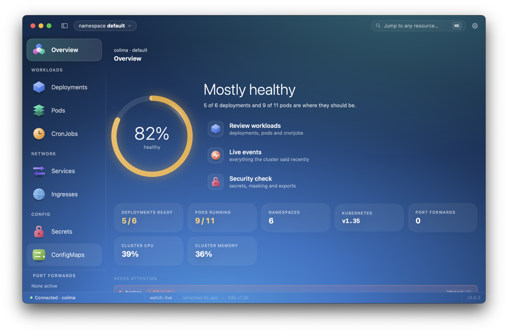
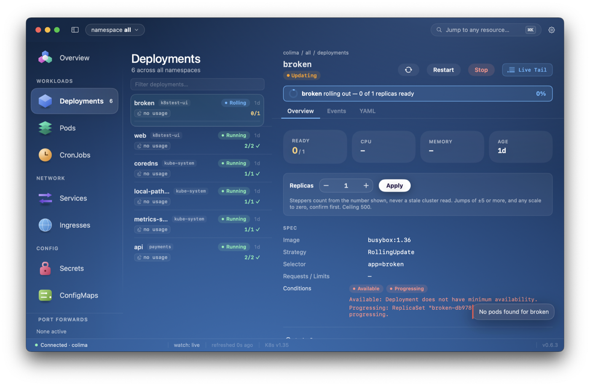
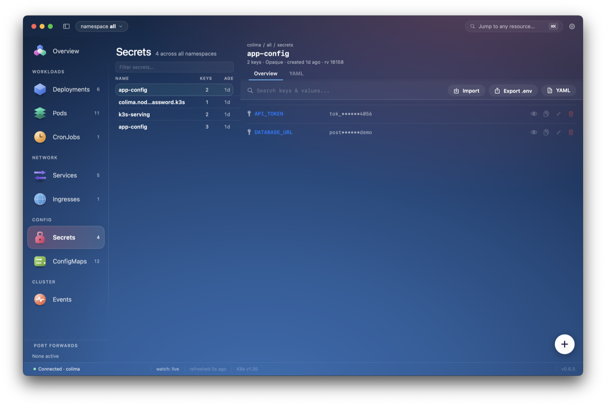
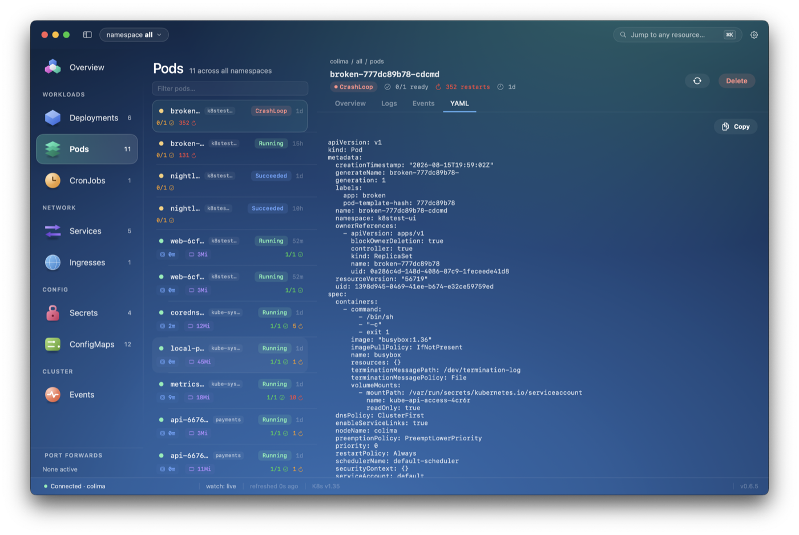
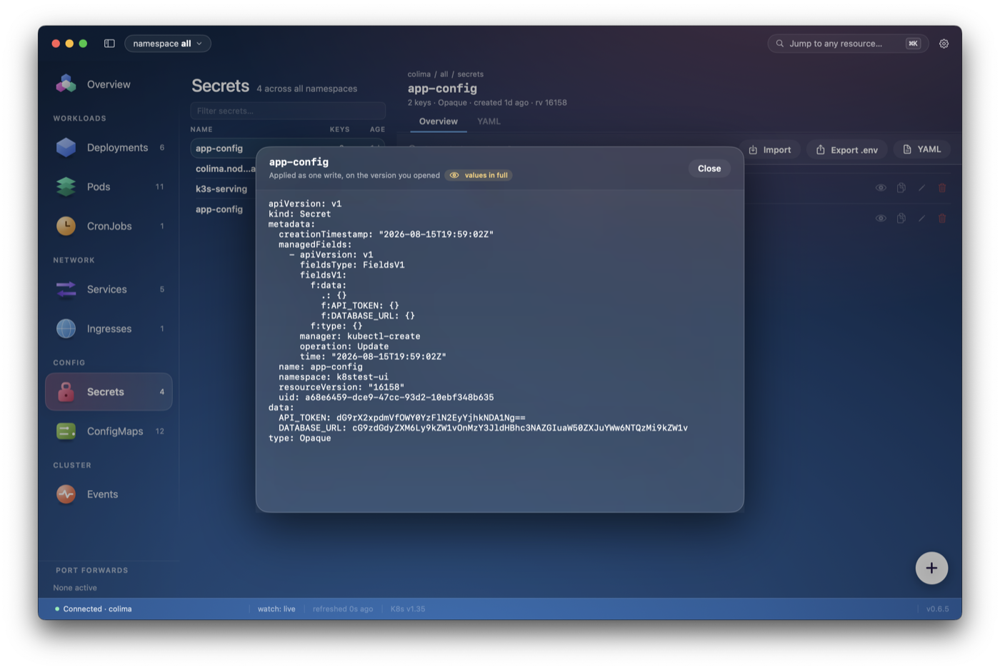
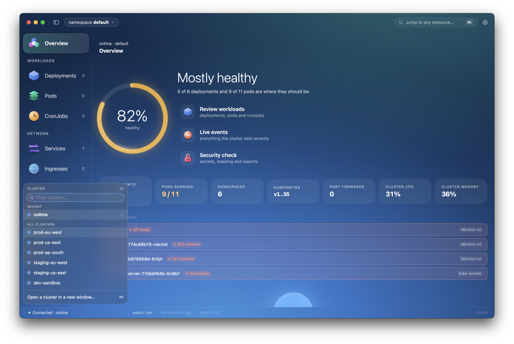
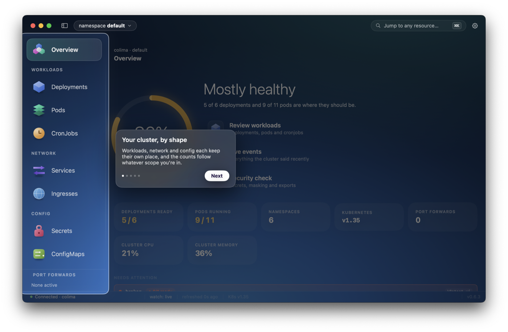
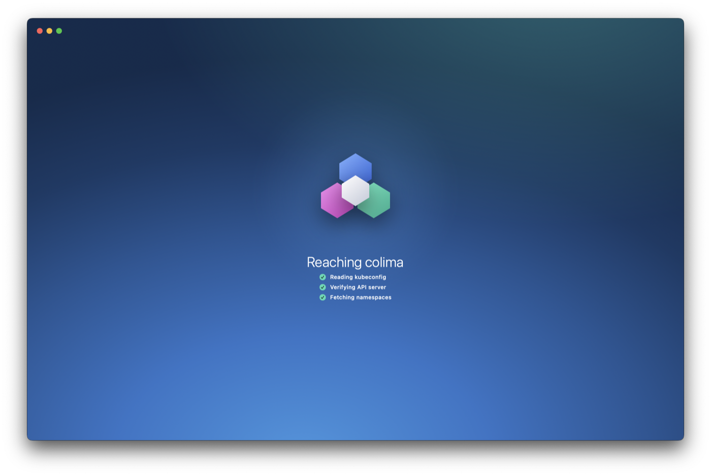

# K8Secret

A native macOS app for Kubernetes — secrets, deployments, pods, services, cronjobs, ingresses, logs and port-forwards — in one window that behaves like a Mac app rather than a terminal wearing a UI.



K8Secret talks to the Kubernetes API directly using your `~/.kube/config` (no kubectl shell-out except for port-forwards), so it is fast, genuinely multi-cluster, and cmd-tab-able.

**0.6 rebuilt the interface.** Every window is one cluster, painted in a color you choose, so which cluster you are looking at is answerable from across the room — and a window that is showing production can be made unmistakable.

---

## Features

### Overview — the answer before the detail

A health ring and one sentence: how much of the cluster is where it should be. What needs attention is listed under it, so the first screen is a verdict rather than a table you have to read.

### Deployments — scale in place, watch the rollout

Replica counts, images, conditions, labels and events. The stepper counts from the number shown rather than a stale read; a jump of ±5 or more, and any scale to zero, asks first. A rollout is a ring that fills, not a spinner that spins.



### Pods — usage against requests, and live logs

CPU and memory per pod with the ratio against its requests, restart counts, placement, containers and events. Logs stream in their own window with search and severity filters.


### Secrets — covered until you ask

Opaque secrets decode into plain key/value pairs, **masked by default** and revealed one at a time, so opening a namespace on a shared screen doesn't expose everything in it. Copying a value marks the clipboard item concealed — clipboard managers skip it, Universal Clipboard doesn't sync it — and clears it after 45 seconds.

Edits are staged and applied as a **single atomic merge-patch**, conditional on the `resourceVersion` the secret was read at: either every change lands or none does, and if someone else edited it meanwhile you get a conflict instead of silently clobbering their work. Bulk import from `.env` or JSON, and export the same way.



### YAML — the live manifest, a tab away

Every resource shows what the API server actually returns, with `managedFields` dropped the way kubectl drops it. Secret values stay redacted here: base64 is not encryption, and opening a tab is not asking to see them.



A secret's manifest is editable in place — applied as one write, on the version you opened, and honest about showing values in full while you do.



### As many clusters as you keep

⌘N opens a chooser rather than a second window onto the same place. Open ten if you like — each window has its own cluster, namespace, scope and selection. Both pickers filter by name, count what they list, and put the clusters you actually use on top.



### It introduces itself

A first run that asks which cluster to start with, and a guided tour that spotlights the real controls where they sit — the rail, the namespace menu, ⌘K, secrets, the switcher. It is offered again after a release that adds things worth pointing at, and lives in Settings the rest of the time.



And it opens like an app: the mark assembles, then flies into the rail it becomes.



### Everywhere else

⌘K jumps to any resource in any namespace by name. Port-forwards live in the rail's foot with a live dot each. Events stream per resource and cluster-wide. Every list is keyboard-navigable, and background polling never moves your selection or your scroll.

---

## Install

One-liner (downloads the latest signed `.dmg`, copies `K8Secret.app` to `/Applications`):

```bash
curl -fsSL https://raw.githubusercontent.com/jai-bhardwaj/k8secret/main/release/install.sh | bash
```

Homebrew:

```bash
brew install --cask jai-bhardwaj/tap/k8secret
```

Or grab the `.dmg` manually from the [latest GitHub release](https://github.com/jai-bhardwaj/k8secret/releases/latest), or look up the version + URL via the [release manifest](https://raw.githubusercontent.com/jai-bhardwaj/k8secret/main/release/latest.json).

The installer verifies the DMG's **SHA-256 against the signed release manifest** before mounting it, and refuses to install on a mismatch. If you download manually, check it yourself:

```bash
shasum -a 256 K8Secret-*.dmg
# compare against the "sha256" field in release/latest.json
```

### Why does macOS warn about this app?

K8Secret ships **ad-hoc signed and not notarized**, and that's a deliberate choice: this is a free, open-source personal project, and notarization requires a paid Apple Developer account. Both installers above remove the quarantine flag after verifying the download, so you won't see a Gatekeeper prompt — but it means you are trusting the checksum chain above rather than Apple's notarization.

What stands in for notarization here:

- every release publishes its **SHA-256** in a manifest that lives in this repo, versioned with the code that produced it,
- the installer, the Homebrew cask, and the in-app updater **all refuse** an artifact that doesn't match it,
- the entire source is here to read, and [building it yourself](#building-from-source) takes two commands.

If you downloaded the `.dmg` by hand and macOS blocks it ("Apple cannot check it for malicious software"), verify the checksum as shown above, then clear the flag yourself:

```bash
xattr -dr com.apple.quarantine /Applications/K8Secret.app
```

If that tradeoff isn't acceptable for your environment, build from source.

---

## Requirements

- macOS **14 (Sonoma) or later** — uses SwiftUI's `@Observable` and Swift concurrency
- A working `~/.kube/config` with at least one context
- `kubectl` in your `PATH` if you want port-forwarding (K8Secret looks at `/usr/local/bin/kubectl`, `/opt/homebrew/bin/kubectl`, then falls back to `kubectl` on `PATH`)

K8Secret reads kubeconfig directly — token auth, client certificates, and `exec` credential plugins (e.g. AWS IAM Authenticator, `gke-gcloud-auth-plugin`) all work. `KUBECONFIG` is honoured, including a colon-separated list, which is merged the way kubectl merges it. Certificates and keys are read whether they're inline (`-data`) or file paths, and EC keys are supported as well as RSA — which covers what k3s, colima, kind and kubeadm write.

Client-certificate clusters need a keychain, because macOS will only present a certificate from a keychain-resident key. K8Secret never touches your login keychain: it creates a throwaway keychain in the temp directory, with a random name and password, that is never added to your keychain search list and is deleted when the app quits. **You are never asked for a keychain password.**

---

## Building from source

```bash
git clone https://github.com/jai-bhardwaj/k8secret.git
cd k8secret/macos
swift build -c release
swift test          # unit tests
```

The binary lands at `.build/arm64-apple-macosx/release/K8Secret`. To produce a runnable `.app` bundle, copy the binary into `build/K8Secret.app/Contents/MacOS/k8secret` and ad-hoc sign:

```bash
codesign --force --sign - build/K8Secret.app
```

A complete release pipeline (DMG creation, version bump, GitHub release upload via `gh` CLI) is in [`macos/release/publish.sh`](macos/release/publish.sh). The public installer + manifest live at the repo root in [`release/`](release/) so they're shared across future platforms.

---

## Auto-updates

K8Secret checks `latest.json` on launch and shows an in-app banner when a new version is available. Updates apply with a single click — the app downloads the DMG, verifies it, swaps `K8Secret.app` in `/Applications`, and relaunches.

Before anything is mounted or installed, the updater:

1. requires the download URL to be **HTTPS on a known GitHub release host** (the manifest is remote data, so its `url` is treated as untrusted input),
2. requires the manifest to publish a **SHA-256**, and refuses the update if it's missing,
3. **verifies the downloaded DMG against that digest** and aborts on any mismatch.

You can disable update checks by removing `AppConstants.updateManifestURL` in source — there's no setting toggle yet.

---

## Project layout

```
macos/                          # the macOS app (the current product)
├── Package.swift               # SwiftPM manifest
├── Tests/K8SecretTests/        # unit tests (swift test)
├── Sources/K8Secret/
│   ├── K8SecretApp.swift       # @main entry, scene config
│   ├── Models/
│   │   ├── K8sClient.swift     # direct K8s API client (URLSession + TLS)
│   │   ├── KubeConfig.swift    # kubeconfig parsing
│   │   ├── PortForwardManager.swift
│   │   ├── UpdateChecker.swift
│   │   └── YAMLParser.swift
│   ├── ViewModels/
│   │   ├── AppState.swift      # @Observable root state
│   │   └── LogStreamState.swift
│   └── Views/                  # SwiftUI views per resource type
├── dmg/                        # DMG packaging assets
└── release/
    └── publish.sh              # build + sign + create GitHub release

release/                        # platform-agnostic installer + manifest
├── install.sh                  # public install one-liner
└── latest.json                 # current-version manifest (served via raw.githubusercontent)
```

The repo also contains an older Go/Wails prototype at the root and in `desktop/`, `internal/` — kept around for reference, not actively maintained.

---

## Privacy

K8Secret runs entirely on your machine. The only outbound network calls are:

1. **Your Kubernetes API servers** (whatever's in your kubeconfig)
2. **`raw.githubusercontent.com`** — to check for app updates (one small JSON fetch on launch)
3. **`github.com`** — to download new versions when one is available

No telemetry, no analytics, no crash reporting. Secrets never leave your laptop.

## Security

- **TLS is verified, and fails closed.** The API server's certificate is evaluated against the CA in your kubeconfig, with hostname verification on. If the chain doesn't validate, the connection is refused rather than downgraded. The only way to skip verification is to set `insecure-skip-tls-verify: true` on that cluster yourself.
- **App Transport Security is on.** Plaintext HTTP is permitted only for local networking, so `kubectl proxy` and local clusters still work.
- **Client keys stay private.** When a kubeconfig uses client-certificate auth, the key is staged in a `0700` directory with `0600` files and a single-use passphrase passed via the environment, never via `argv`.
- **Credential plugins are cached.** `exec` credentials (EKS, GKE, AKS) are reused until just before they expire instead of being re-fetched on every request.

Known gaps, tracked and not yet closed: the app is **not notarized**, and secret values are held in memory as ordinary Swift strings (so they can reach swap). See the audit notes in the repo for the full list.

---

## License

MIT — see [LICENSE](LICENSE).
